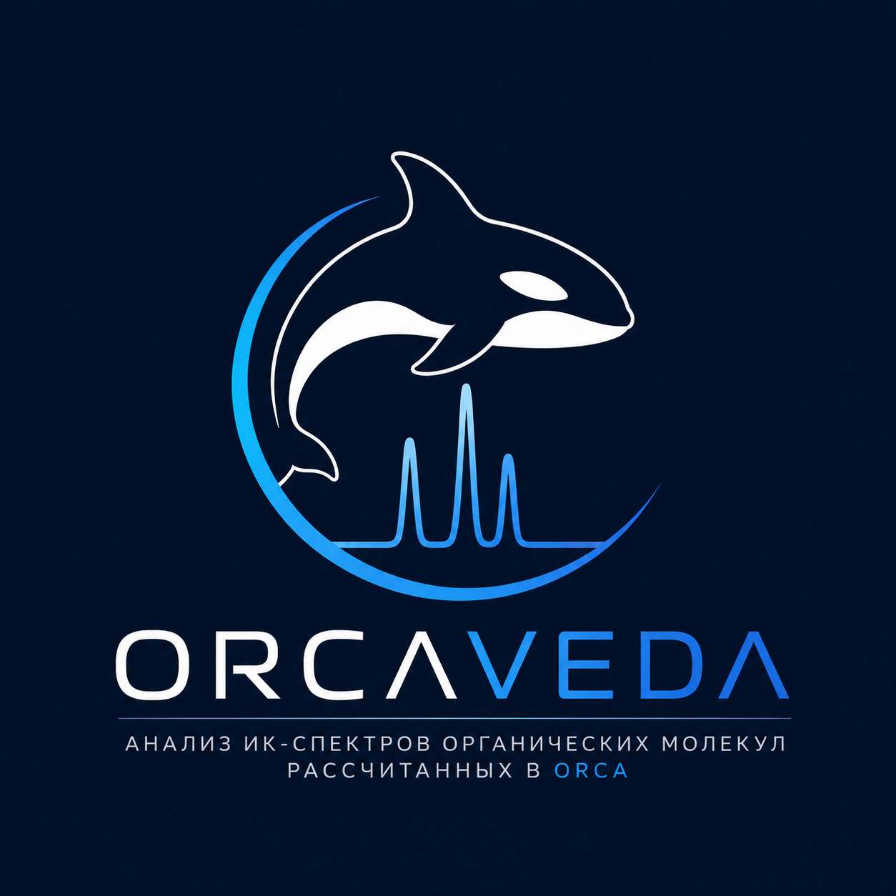

# ORCAVEDA

<p align="center">
  
</p>

ORCAVEDA is an ORCA `.hess` vibrational analysis toolkit. It parses ORCA Hessian files, builds internal-coordinate diagnostics, assigns vibrational modes, writes regression artifacts, and can generate interactive spectrum viewers for inspection.

The current baseline is ORCAVEDA v5.0. Its assignment layer is a geometric and weighted independent-coordinate audit. ORCAVEDA also includes PED-like diagnostic layers, including B-matrix projection, force-aware diagnostics, and Wilson GF-style PED audit outputs when the required Hessian data are available. These layers are diagnostic evidence, not a strict VEDA-equivalent validation suite.

## Repository Contents

- `src/`: parser, chemistry backends, internal coordinates, mode assignment, PED diagnostics, reports, web import UI, and NIST IR workflow code.
- `data/hess/`: checked-in ORCA `.hess` examples used by tests and regression checks.
- `tests/`: pytest suite for parser behavior, chemistry semantics, ORCAVEDA v5.0 outputs, PED diagnostics, NIST IR handling, and the interactive viewer.
- `expectations/`: machine-readable ORCAVEDA v5.0 regression expectations.
- `reports/`: checked-in regression summaries for the ORCAVEDA v5.0 baseline.
- `outputs/`: generated local output directory. It is intentionally ignored by Git.

## Fresh Setup

From a clean checkout on Windows PowerShell:

```powershell
py -3.12 -m venv .venv312
.\.venv312\Scripts\python.exe -m pip install --upgrade pip
.\.venv312\Scripts\python.exe -m pip install -r requirements.txt
.\.venv312\Scripts\python.exe -m pytest -q
```

The root pytest command is configured by `pytest.ini` to collect only `tests/`.

## ORCAVEDA v5.0 Regression

Generate fresh ORCAVEDA v5.0 outputs and validate them against the checked-in expectations:

```powershell
.\.venv312\Scripts\python.exe src\ORCAVEDA_patched_stage3D_v5_0.py `
  data\hess\Acetone_freq.hess data\hess\CH3CN_freq.hess data\hess\DMF_freq.hess data\hess\DMSO_freq.hess `
  data\hess\EtOH_freq.hess data\hess\MeOH_freq.hess data\hess\NMP_freq.hess data\hess\iPrOH_freq.hess `
  --outdir outputs\regression_live

.\.venv312\Scripts\python.exe run_regression_tests.py `
  --outdir outputs\regression_live `
  --expectations expectations\regression_expectations_stage3D_v5_0.json
```

The regression runner writes:

- `regression_harness_results_stage3D_v5_0.csv`
- `regression_harness_summary_stage3D_v5_0.json`

## Web Import UI

Run the local web import server:

```powershell
.\.venv312\Scripts\python.exe src\web_app.py
```

Then open `http://127.0.0.1:8765/` and upload one or more ORCA `.hess` files. Generated reports are written under `outputs/`.

## NIST IR Workflow

Run the NIST IR helper CLI with an ORCA `.hess` file:

```powershell
.\.venv312\Scripts\python.exe run_nist_ir.py `
  --hess data\hess\NMP_freq.hess `
  --outdir outputs\nist_ir_nmp_live
```

NIST IR references are treated as reference records for comparison. The workflow distinguishes suitable IR curve references from unsuitable records such as absorption-index-only entries.

## Interactive Viewer Assets

Generated interactive HTML reports use the public 3Dmol.js CDN by default and fall back to a native 2D molecule projection if 3Dmol.js cannot load. For fully self-contained offline reports, call `write_interactive_spectrum_viewer(..., three_dmol_js_path="path\\to\\3Dmol-min.js")`; the local asset is inlined into the generated HTML.

## Scientific Boundary

ORCAVEDA reports assignment evidence from source code, parsed `.hess` data, generated outputs, and tests. It should not be described as a strict VEDA PED implementation or as a publication-grade universal benchmark validation suite unless that method is separately implemented and validated.

For ORCA normal modes, the preserved orientation is:

```python
normal_mode_vector = normal_modes[:, mode]
```

Generated outputs, virtual environments, caches, and local UI artifacts are intentionally excluded from Git.
