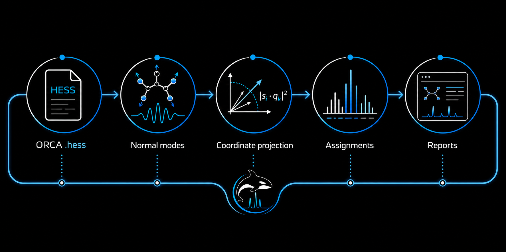

# ORCAVEDA

<p align="center">
  
</p>

<p align="center">
  <strong>
    <span style="color:#0B84FF;">ORCA .hess</span>
    <span style="color:#666666;"> -> </span>
    <span style="color:#00A6D6;">Normal modes</span>
    <span style="color:#666666;"> -> </span>
    <span style="color:#8250DF;">Coordinate projection</span>
    <span style="color:#666666;"> -> </span>
    <span style="color:#1F883D;">Assignments</span>
    <span style="color:#666666;"> -> </span>
    <span style="color:#D1242F;">Reports</span>
  </strong>
</p>

<p align="center">
  
</p>

ORCAVEDA turns ORCA vibrational calculations into a readable chemical interpretation. The program follows the same five-stage pipeline shown above: it reads the ORCA Hessian file, extracts normal modes, compares those modes with internal-coordinate motions, ranks the diagnostic evidence, and presents the result in reports.

The main question is:

<p align="center">
  <strong><span style="color:#0B84FF;">Which molecular motions explain this vibrational band?</span></strong>
</p>

ORCAVEDA is an evidence layer. It helps inspect calculated vibrations, but it does not replace chemical judgment, experimental spectra, or a separately validated full PED workflow.

## Current Status

Current development status:

- Stage 3D remains the default assignment audit and uses finite-difference B matrices unless explicitly changed.
- PED, force-aware PED, Wilson GF-style PED, Wilson GF validation, and comparable VEDA-like outputs are diagnostic evidence layers, not automatic proof of original VEDA reproduction.
- Hybrid analytical B matrices are available as an opt-in method with finite-difference fallback for unsupported or near-singular rows.
- EPM-like Wilson GF/PED basis optimization is opt-in and affects only Wilson GF validation / VEDA-like diagnostics, not the default Stage 3D assignment labels.
- NIST IR comparison and scale-factor diagnostics are available when suitable reference spectra are present.
- Original VEDA reference comparison is supported through normalized reference CSVs; native `.ved` / `.vdf` ingest is not implemented yet.
- Recent audit hardening fixed composed-PED X-H triage, RDKit neighbor guards, NIST User-Agent wording, `.hess` decode diagnostics, web upload timeout handling, scale-factor weighted-model reporting, and zero-vector mode tracking.

## Quick Start

Run the default Stage 3D workflow on one or more ORCA `.hess` files:

```powershell
.\.venv312\Scripts\python.exe src\ORCAVEDA_patched_stage3D_v5_0.py data\hess\H2O_freq.hess --outdir outputs\h2o_default
```

List chemistry backends:

```powershell
.\.venv312\Scripts\python.exe src\ORCAVEDA_patched_stage3D_v5_0.py --list-chem-backends
```

Run with the RDKit backend when RDKit is installed:

```powershell
.\.venv312\Scripts\python.exe src\ORCAVEDA_patched_stage3D_v5_0.py data\hess\acetophenone.hess --chem-backend rdkit --outdir outputs\acetophenone_rdkit
```

Enable opt-in diagnostic layers:

```powershell
.\.venv312\Scripts\python.exe src\ORCAVEDA_patched_stage3D_v5_0.py data\hess\H2O_freq.hess --outdir outputs\h2o_veda_like --wilson-gf-validation --veda-like-ped
```

Use the opt-in hybrid analytical B matrix:

```powershell
.\.venv312\Scripts\python.exe src\ORCAVEDA_patched_stage3D_v5_0.py data\hess\H2O_freq.hess --outdir outputs\h2o_hybrid_b --b-matrix-method hybrid_analytical
```

The default `--b-matrix-method finite_difference` is preserved for reproducibility.

## Pipeline Overview

The image summarizes the workflow:

- <span style="color:#0B84FF;"><strong>ORCA .hess</strong></span>: read the molecular geometry and vibrational data.
- <span style="color:#00A6D6;"><strong>Normal modes</strong></span>: recover how atoms move in each calculated vibration.
- <span style="color:#8250DF;"><strong>Coordinate projection</strong></span>: compare each normal mode with bonds, angles, torsions, and other internal motions.
- <span style="color:#1F883D;"><strong>Assignments</strong></span>: rank the strongest chemical contributions.
- <span style="color:#D1242F;"><strong>Reports</strong></span>: show spectra, assignments, diagnostics, and uncertainty in a readable form.

The pipeline is intentionally diagnostic. A mode can be mixed, and the report should preserve that mixture instead of forcing every band into a single label.

## Stage 1: ORCA .hess

The first stage is the ORCA Hessian file. It contains the molecular structure and the vibrational information produced by the quantum-chemical calculation.

The key physical object is the Cartesian Hessian:

$$
H_{ij}=\frac{\partial^2 E}{\partial x_i \partial x_j}
$$

This matrix describes the curvature of the molecular energy surface. If the energy changes steeply when atoms move along a direction, that direction is associated with a stronger restoring force.

For vibrational analysis, the Hessian is usually considered in mass-weighted form:

$$
F = M^{-1/2} H M^{-1/2}
$$

where:

- <span style="color:#8250DF;"><strong>H</strong></span> is the Cartesian Hessian;
- <span style="color:#8250DF;"><strong>M</strong></span> is the mass matrix;
- <span style="color:#00A6D6;"><strong>F</strong></span> is the mass-weighted force-constant matrix.

In plain language:

<p align="center">
  <strong><span style="color:#0B84FF;">the .hess file is the evidence source, not a hand-written assignment table.</span></strong>
</p>

## Stage 2: Normal Modes

The second stage extracts the normal modes. A normal mode is a collective atomic motion: atoms move together in a coordinated pattern.

Mathematically, normal modes come from the eigenvalue problem:

$$
F q_k = \lambda_k q_k
$$

Here:

- <span style="color:#00A6D6;"><strong>q_k</strong></span> is the displacement vector for mode k;
- <span style="color:#0B84FF;"><strong>lambda_k</strong></span> is connected to the squared vibrational frequency;
- <span style="color:#1F883D;"><strong>k</strong></span> indexes the vibrational mode.

The frequency is related to the eigenvalue conceptually as:

$$
\nu_k \propto \sqrt{\lambda_k}
$$

This is why high-curvature, light-atom motions often appear at higher frequency. X-H stretches are a typical example:

$$
X-H \in \{C-H,\ N-H,\ O-H\}
$$

ORCAVEDA keeps these high-frequency X-H modes visible in diagnostics. They should not silently remain unassigned when the input data supports a meaningful signal.

## Stage 3: Coordinate Projection

The third stage compares normal modes with internal-coordinate motion patterns.

ORCAVEDA builds chemically interpretable motions such as:

- bond stretches;
- angle bends;
- torsions;
- out-of-plane motions;
- functional-group patterns.

Let:

$$
q_k = \text{normal-mode displacement for mode } k
$$

$$
s_i = \text{internal-coordinate motion pattern } i
$$

The basic alignment score is an overlap:

$$
a_{ik} = s_i \cdot q_k
$$

The diagnostic contribution can then be represented as:

$$
C_{ik} = |s_i \cdot q_k|^2
$$

This says: if internal coordinate i moves in the same direction as normal mode k, it receives a larger contribution score.

To compare coordinates inside one mode, the contributions can be normalized:

$$
P_{ik} = \frac{C_{ik}}{\sum_j C_{jk}} \times 100\%
$$

Read this as:

<p align="center">
  <strong><span style="color:#8250DF;">P_ik is the relative diagnostic share of coordinate i in mode k.</span></strong>
</p>

When mass or force information is available, ORCAVEDA can add weighted diagnostics:

$$
C^{weighted}_{ik} = w_i |s_i \cdot q_k|^2
$$

The practical distinction is:

<p align="center">
  <strong>
    <span style="color:#00A6D6;">geometry shows what moves</span>
    <span style="color:#666666;"> + </span>
    <span style="color:#8250DF;">weights help judge what matters</span>
  </strong>
</p>

This stage is PED-like because it uses projection-style evidence. It should not be described as strict VEDA PED unless a separate validated implementation is actually used.

## Stage 4: Assignments

The fourth stage converts ranked coordinate evidence into readable chemical assignments.

An assignment is not a single absolute name. It is a ranked interpretation of the strongest diagnostic contributors.

For example, a mode might look like:

- <span style="color:#0B84FF;"><strong>52%</strong></span> C=O stretch;
- <span style="color:#00A6D6;"><strong>21%</strong></span> C-N stretch;
- <span style="color:#1F883D;"><strong>14%</strong></span> CH3 deformation;
- <span style="color:#8250DF;"><strong>remaining share</strong></span> smaller mixed motions.

The safe reading is:

$$
\text{mode } k \approx \text{C=O stretch with mixed C-N and CH}_3 \text{ character}
$$

not:

$$
\text{mode } k = \text{pure C=O stretch}
$$

This distinction matters because real normal modes are often mixed. ORCAVEDA should preserve mixed evidence instead of hiding it behind a single overconfident label.

Functional-group semantics make the assignments easier to read. The program can connect coordinate evidence to patterns such as:

- <span style="color:#0B84FF;"><strong>carbonyl-like</strong></span> C=O stretching;
- <span style="color:#00A6D6;"><strong>alcohol-like</strong></span> O-H motion;
- <span style="color:#1F883D;"><strong>alkyl</strong></span> methyl and methylene deformation;
- <span style="color:#8250DF;"><strong>nitrile-like</strong></span> C≡N stretching;
- <span style="color:#D1242F;"><strong>amide-like</strong></span> coupled C-N and C=O motion.

These labels are useful, but they remain traceable diagnostic labels. They should be read together with the underlying scores and mode evidence.

## Stage 5: Reports

The fifth stage presents the results. ORCAVEDA reports are meant to make the evidence inspectable, not just decorative.

A useful report connects:

- <span style="color:#0B84FF;"><strong>spectrum peaks</strong></span>;
- <span style="color:#00A6D6;"><strong>normal modes</strong></span>;
- <span style="color:#8250DF;"><strong>projection scores</strong></span>;
- <span style="color:#1F883D;"><strong>chemical assignments</strong></span>;
- <span style="color:#D1242F;"><strong>diagnostic warnings</strong></span>.

For reference comparison, a simple frequency difference is:

$$
\Delta \nu = |\nu_{calc} - \nu_{ref}|
$$

If a scale factor is used:

$$
\nu_{scaled} = s \nu_{calc}
$$

then:

$$
\Delta \nu_{scaled} = |\nu_{scaled} - \nu_{ref}|
$$

This comparison is diagnostic, not automatic validation. Calculated spectra depend on method, basis set, scaling, phase, environment, and reference-record quality.

## Scientific Boundary

ORCAVEDA v5.0 uses a geometric and weighted independent-coordinate assignment audit. It may be described as PED-like because it uses projection-style diagnostic evidence.

It should not be described as a strict VEDA PED implementation or a full Wilson GF PED method unless those methods are separately implemented and validated.

Current diagnostic layers use these boundaries:

- `assignment_audit`: default Stage 3D geometric / weighted independent-coordinate assignment audit.
- `ped_audit`: normalized projection-style PED diagnostic.
- `ped_v2_force_audit`: force-aware diagnostic layer.
- `wilson_ped_audit`: Wilson GF-style PED audit.
- `wilson_gf_validation`: opt-in Wilson GF diagonalization validation prototype.
- `veda_like_*`: opt-in comparable VEDA-like closed Wilson GF/PED diagnostics.
- `composed_ped_*`: composed-coordinate diagnostic evidence and policy triage.

None of these outputs should be reported as original VEDA reproduction unless checked original VEDA reference rows are compared and the comparison passes.

## VEDA-Like Output Validation

The opt-in `--veda-like-ped` path emits diagnostic `veda_like_*` artifacts. These outputs are comparable VEDA-like diagnostics; they do not reproduce original VEDA.

After generating a VEDA-like output directory, validate the artifacts with:

    .\.venv312\Scripts\python.exe tools\validate_veda_like_outputs.py outputs\veda_like_full_sweep_validated_live

The validator reports two statuses:

- `validation_status`: scientific/data status from the artifacts. `WARN` means review is required, not that the run failed.
- `acceptance_status`: gate status after optional warning-token allowlisting.

For a known full-sweep review set, pass allowed warning tokens explicitly:

    .\.venv312\Scripts\python.exe tools\validate_veda_like_outputs.py outputs\veda_like_full_sweep_validated_live --allowed-warning-token empirical_ratio_only --allowed-warning-token fixed_conversion_failed --allowed-warning-token high_frequency_hbond_dominates_xh_stretch_secondary --allowed-warning-token linear_bend_coordinate_used --allowed-warning-token linear_or_near_linear_fixed_conversion_review --allowed-warning-token near_linear_bend_coordinate --allowed-warning-token nonpositive_gf_eigenvalues_within_expected_vibrational_space --allowed-warning-token nonpositive_orca_modes_within_expected_vibrational_space --allowed-warning-token positive_gf_eigenvalue_count_below_expected_vibrational_rank --allowed-warning-token positive_orca_mode_count_below_expected_vibrational_rank

The allowlist is intentionally explicit. New warning tokens should be investigated before they are allowed.

## VEDA Reference Comparison

The comparison harness lives in `benchmarks/veda_compare/`. It compares ORCAVEDA `veda_like_*` CSV artifacts with checked-in original VEDA reference rows when normalized references exist.

Normalize an already prepared reference CSV directory:

```powershell
.\.venv312\Scripts\python.exe benchmarks\veda_compare\convert_veda_reference.py --raw-reference <raw-reference-dir> --out benchmarks\veda_compare\references\<set-name>
```

Compare ORCAVEDA outputs with normalized references:

```powershell
.\.venv312\Scripts\python.exe benchmarks\veda_compare\compare_veda_outputs.py --orcaveda outputs\veda_like_full_sweep_live --reference benchmarks\veda_compare\references\<set-name> --out outputs\veda_reference_compare_live
```

Status meanings:

- `PASS`: reference rows exist and implemented comparisons are within tolerance.
- `FAIL`: reference rows exist, but a required artifact, row, dominant contributor, or tolerance check failed.
- `SKIP`: original VEDA reference rows are absent; this is not validation success.

The current converter accepts normalized CSVs or explicit CSV column mappings. Native VEDA `.ved` / `.vdf` parsing is future work.

## NIST IR and Scaling

The NIST IR workflow is a reference-comparison layer. It must distinguish suitable IR curve references from unsuitable records and should not be used as automatic assignment proof.

Scale-factor model comparison reports `global_weighted_ls` only when explicit weights are available. Without weights, the unweighted global LS model is reported instead of duplicating an identical weighted model.

NIST requests use an ORCAVEDA project User-Agent rather than a browser-spoofed string. Live NIST retrieval can still depend on external service behavior.

## Web Import Server

The local web import server provides browser-based `.hess` upload and interactive viewer access:

```powershell
.\.venv312\Scripts\python.exe src\web_app.py
```

Default bind address:

```text
http://127.0.0.1:8765/
```

The server is intended for local research workflows. It enforces an upload size limit and now sets a request-body socket timeout, but it is not hardened as an internet-facing service.

The safe boundary is:

$$
\text{ORCAVEDA} = \text{calculated vibrations} + \text{transparent diagnostic interpretation}
$$

not:

$$
\text{ORCAVEDA} = \text{experimental proof of a unique assignment}
$$

## What ORCAVEDA Is For

ORCAVEDA is useful when you need to:

- inspect ORCA vibrational calculations;
- understand which internal motions dominate each normal mode;
- compare calculated bands with IR references;
- detect unclear or mixed assignments;
- produce reproducible vibrational-analysis artifacts.

The goal is transparency:

<p align="center">
  <strong>
    <span style="color:#0B84FF;">show the input</span>
    <span style="color:#666666;"> + </span>
    <span style="color:#00A6D6;">show the motion</span>
    <span style="color:#666666;"> + </span>
    <span style="color:#8250DF;">show the score</span>
    <span style="color:#666666;"> + </span>
    <span style="color:#1F883D;">show the assignment</span>
    <span style="color:#666666;"> + </span>
    <span style="color:#D1242F;">show the uncertainty</span>
  </strong>
</p>
